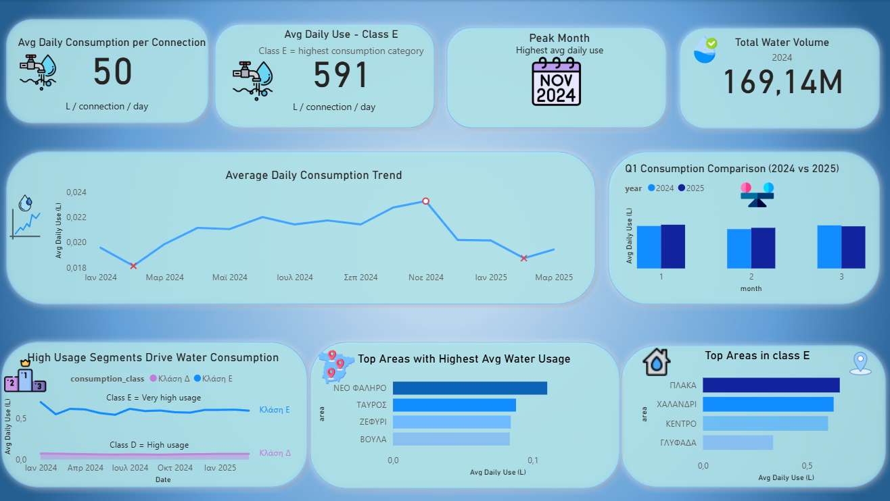

# Water Consumption Analysis

## Project Description
This project analyzes water consumption patterns using municipal data from 2024 and early 2025.  
The goal is to understand how consumption evolves over time and identify the main drivers behind usage.

## Data Processing Pipeline
- Raw consumption data was collected from source files  
- Data was cleaned and transformed using Python (pandas)  
- Consumption was normalized per connection and per day  
- Data was stored and queried using MySQL  
- Final insights were visualized using Power BI

## Project Structure

[data/](data/) | Raw and processed datasets |    
[images/](images/) | Dashboard screenshot |    
[sql/](sql/) | SQL scripts |    
[powerbi/](powerbi/) | Dashboard file |    
[src/](src/) | Python scripts |    

## Tools
- Python (data cleaning & transformation)  
- MySQL (data querying & analysis)  
- Power BI (data visualization

## Key Metrics
- Consumption per connection per day (normalized metric)  
- Total water consumption (volume)  
- Average consumption by category (A–E)

## Key Insights
- Water consumption remains relatively stable over time  
- High-consumption categories (Class D and especially Class E) drive overall usage  
- Class E shows significantly higher consumption per connection  
- Location plays a secondary role compared to consumption category  
- No significant year-over-year change is observed (Q1 2024 vs 2025)

## Dashboard

The Power BI dashboard visualizes:
- Consumption trends over time  
- Breakdown by consumption category  
- Top areas with highest usage  
- Year-over-year comparison

## How to Run
1. Load dataset from [`data/processed/`](data/processed/)    
2. Run Python scripts from [`src/`](src/)    
3. Execute SQL queries from [`sql/`](sql/)    
4. Open dashboard from [`powerbi/water_consumption_dashboard.pbix`](powerbi/water_consumption_dashboard.pbix)

## Limitations
- Outliers were removed for normalized metrics:
  - connections < 10  
  - consumption_days = 0  
  - flagged anomalies (threshold: 0.86)  
- 2025 data is limited to Q1

## Data Source
EYDAP open data (provided files)

## Author
Georgios Konstantopoulos
